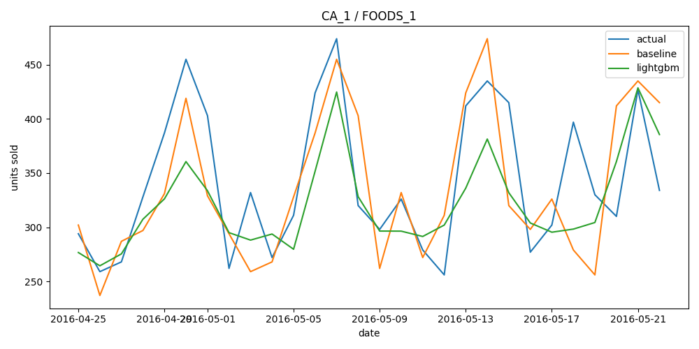

# Retail Demand Forecasting Pipeline

An end-to-end demand forecasting pipeline for retail sales data, built on
PySpark and Delta Lake and run on Databricks.

## Problem

Forecast store/item-level demand from historical retail sales, using
calendar/holiday and pricing context, and evaluate against a naive baseline.

## Data

[M5 Forecasting Accuracy](https://www.kaggle.com/competitions/m5-forecasting-accuracy) —
Walmart store × item × date sales (~30k series, 2011–2016), with pricing and
calendar/holiday event data. Published by the Makridakis Open Forecasting
Center as part of the M5 competition.

> Makridakis, S., Spiliotis, E., & Assimakopoulos, V. (2020).
> *The M5 competition: Background, organization, and implementation.*
> International Journal of Forecasting.

Raw files are not committed (see `.gitignore`) — download from Kaggle and
place under `data/`:

- `calendar.csv`
- `sell_prices.csv`
- `sales_train_evaluation.csv`

## Pipeline

```
data/ (raw CSVs)
  -> upload to Databricks (scripts/upload_to_databricks.sh)
  -> ingest/01_ingest.py                  load raw CSVs into Databricks
  -> ingest/02_clean_join.py              clean, join, write Delta (silver)
  -> features/03_feature_engineering.py   rolling/lag/holiday/price features (gold)
  -> model/04_baseline.py                 seasonal-naive baseline
  -> model/05_train.py                    LightGBM per store/item-group
  -> model/06_evaluate.py                 forecast vs. actual, WMAPE, charts
```

Runs on **Databricks** — each step is a `.py` file meant to run against a
Databricks cluster with Delta Lake available. All paths point at a Unity
Catalog Volume: `/Volumes/workspace/retail_demand/{raw,bronze,silver,gold,predictions}`.

## How to run

1. Download the M5 dataset from Kaggle into `data/`.
2. Configure the Databricks CLI (`databricks configure`) and run
   `scripts/upload_to_databricks.sh` to push the raw CSVs into the
   `raw` Volume.
3. Import this repo's files into a Databricks workspace (or run locally
   against `requirements.txt` for prototyping).
4. Run `ingest/01_ingest.py` through `model/06_evaluate.py` in order.

## Results

Evaluated on a 28-day holdout, aggregated to (store, department):

| Model                    | WMAPE  |
|--------------------------|--------|
| Seasonal-naive baseline  | 0.1398 |
| LightGBM                 | 0.1033 |

LightGBM reduces forecast error by ~26% relative to the naive baseline.


